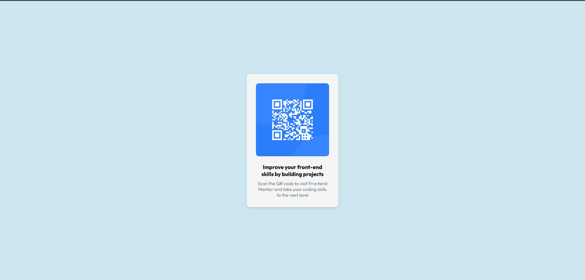

# Frontend Mentor - QR code component solution

This is a solution to the [QR code component challenge on Frontend Mentor](https://www.frontendmentor.io/challenges/qr-code-component-iux_sIO_H). Frontend Mentor challenges help you improve your coding skills by building realistic projects. 

## Table of contents

- [Overview](#overview)
  - [Screenshot](#screenshot)
  - [Links](#links)
  - [Built with](#built-with)
  - [What I learned](#what-i-learned)
  - [Continued development](#continued-development)

## Overview

### Screenshot

### Links

- Solution URL: [Add solution URL here](https://github.com/arv-dev/project1.git)
- Live Site URL: [Add live site URL here](https://project1-sigma-green.vercel.app/)

### Built with

- Semantic HTML5 markup
- Flexbox

### What I learned

I customized the CSS, implemented font imports, and used them.

### Continued development

I still have a lot to learn from css and more experience to go.

